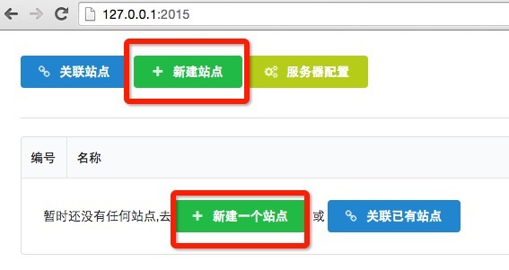

### 1.新建站点
* 打开GUI，点击 `新建站点` 按钮
* 在弹窗中填写站点名称`blog`;填写站点的开发路径(可用 `{{homedir}}`占位符指向用户目录),eg: `{{homedir}}/blog`.
* 点击`创建`,提示成功, 点击弹窗外区域,关闭弹窗，发现 `blog` 站点已经创建
* 点击站点名称,进入站点的模块管理页
* 进入blog站点的项目管理界面,发现lib目录下自动生成了`jquery/1.9.3`和`parser/0.0.1`两个模块

>前端开发一般通过svn,git等版本控制工具进行源码管理，当开发者A创建完站点之后,开发者B就可以通过版本控制工具拉取代码到本地，然后就可以通过 `关联站点` 操作把该站点加入管理列表

### 2.初始化模块
#### <1.初始化www/common/1.0.0模块
* 点击新建模块按钮
* 填写相关的信息 点击创建
* 在GUI中可以发现,该模块已经初始化
* 进入开发目录,发现 `~/blog/www/common/1.0.0`目录下是刚初始化产生的文件
* 至此 `www/common/1.0.0` 模块已经成功初始化
#### <2.初始化www/help/1.0.0模块
* 因为www项目已经存在,所以先点击`www`项目名称,再点击`新建模块`按钮
* 填写相关的信息 点击创建
* 在GUI中可以发现,该模块已经初始化 
* 进入开发目录,发现`~/blogwww/help/1.0.0`目录下是刚初始化产生的文件 

### 3.模块相关信息的查看
#### <1.查看`src`目录下静态文件的id
* 在初始化模块后,可以通过在GUI中点击`文件列表`按钮 
* 接着会弹出src目录下文件的相关信息,包括文件的id 
* 文件的id在跨模块静态文件依赖和跨模块模板中会用到

#### <2.模板预览
* 在初始化模块后,可以通过在GUI中点击`查看模板及数据`按钮,进入模板列表页 
* 列表页列出了`html/`目录下的所有的文件,点击对应的文件即可进行预览
* 当然也可以直接通过地址`http://127.0.0.1:2015/files/site/project/module/version/html/**`打开对应的模板
