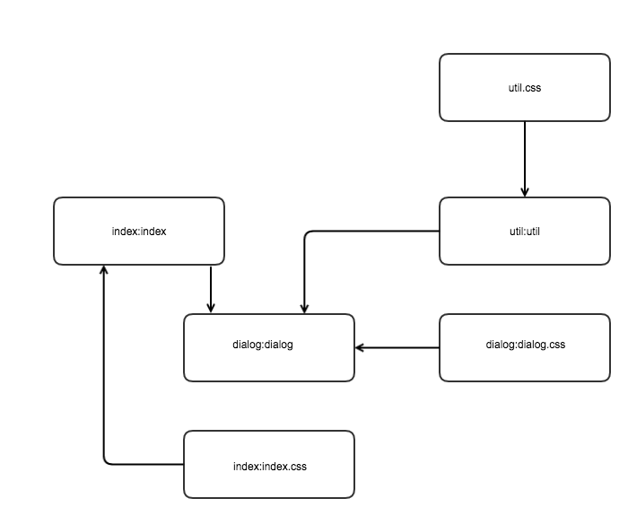

# atmjs工作原理分析

> 下面这个例子只是帮助大家更好的理解atmjs的核心工作原理,并不是最终的数据格式

## 目录关系
```

|--util
    |--util.js
    |--util.css
|--dialog
    |--dialog.js
    |--dialog.css
|--index
    |--index.js
    |--index.css
```

## 文件内容

* util/util.js 文件内容:

```js
// ...
// some javascript codes
// ...

// 声明依赖的css文件
// @require ./util.css
```

* dialog/dialog.js 文件内容:

```js
var util = require('util:util');
// ...
// some javascript codes
// ...

// 声明依赖的css文件
// @require ./dialog.css
```

* index/index.js 文件内容：

```js
var dialog = require('dialog:dialog');
// ...
// some javascript codes
// ...

// 声明依赖的css文件
// @require ./index.css
```

## 构建后生成的三个静态资源关系表
* util模块构建后生成的依赖关系表(util.json)内容：

```js
{
  "res": {
    "util:util.css": {
      "uri": "/util.css",
      "type": "css"
    },
    "util:util": {
      "uri": "/util.js",
      "type": "js",
      "deps": [
        "util:util.css"
      ]
    }
  },
  "pkg": {}
}
```

* dialog模块构建后生成的依赖关系表(dialog.json)内容：

```js
{
  "res": {
    "dialog:dialog.css": {
      "uri": "/dialog.css",
      "type": "css"
    },
    "dialog:dialog": {
      "uri": "/dialog.js",
      "type": "js",
      "deps": [
        "util:util",
        "dialog:dialog.css"
      ]
    }
  },
  "pkg": {}
}
```

* index模块构建后生成的依赖关系表(index.json)内容：

```js
{
  "res": {
    "index:index.css": {
      "uri": "/index.css",
      "type": "css"
    },
    "index:index": {
      "uri": "/index.js",
      "type": "js",
      "deps": [
        "dialog:dialog",
        "index:index.css"
      ]
    }
  },
  "pkg": {}
}
```

## 完整依赖分析
上面三个模块每个在构建后都可以生成一个自己模块内部的依赖表，我们把这种文件称为清单。
我们把上述三个清单综合起来分析，可以得到下面的完整关系图:


通过上图可得到 'index:index'的依赖顺序关系是：
```
1. util.css (util/util.css)
2. util:util (util/util.js)
3. dialog:dialog.css (dialog/dialog.css)
4. dialog:dialog (dialog/dialog.js)
5. index:index.css (index/index.css)
6. index:index (index/index.js)
```
因此当一个页面(假设是index/index.html)的入口文件为`index/index.js`时，该页面需要的js和css资源也就可以确定下来：
```html
<!-- 依赖的css文件 -->
<link rel="stylesheet" href="util/util.css"/>
<link rel="stylesheet" href="dialog/dialog.css"/>
<link rel="stylesheet" href="index/index.css"/>

<!-- 依赖的js文件 -->
<script src="util/util.js"></script>
<script src="dialog/dialog.js"></script>
<script src="index/index.js"></script>
```
atmjs里通过`地图`的操作分析出这种完整依赖关系并保存成json文件（index/map.json）供后端程序调用：
```json
{
  "index:index": {
    "css": "<link rel=\"stylesheet\" href=\"util/util.css\"/><link rel=\"stylesheet\" href=\"dialog/dialog.css\"/><link rel=\"stylesheet\" href=\"index/index.css\"/>",
    "js": "<script src=\"util/util.js\"></script><script src=\"dialog/dialog.js\"></script><script src=\"index/index.js\"></script>"
  }
}
```

* 我们把这种json文件称为“地图文件”，把生成地图文件的操作称为“地图”操作
* 地图文件是通过对清单文件的分析后生成的，因此，入口文件依赖的全部模块必须是构建过的（因为模块构建过之后才会出现清单文件）
* 后端开发者可以根据地图文件去实现静态资源调用的类，通过页面的入口id找到相应模板对应的css和js资源，
  从而动态生成对应的css和js标签。

## 后端sdk的简易实现(php demo)
```php
<?php
  class Atmjs{
    private $datas;
    private $path_prefix = '/path/to/maps/';
    public function import($id){
      $arr = explode(':', $id);
      $map_path = $this->path_prefix.$arr[0].'/map.json';
      $datas = @file_get_contents($map_path);
      $datas = json_decode($datas, true);
      $this->datas = $datas[$id];
    }
    public function loadCss() {
      echo $this->datas['css'];
    }
    public function loadJs() {
      echo $this->datas['js'];
    }
  }
?>
```
* 从上面可以看出,不管后端是什么语言,sdk的实现都非常简单,因此可以说atmjs开放系统是不受后端语言限制的

## 后端sdk调用(php demo)
```php
<!doctype html>
<?php
  // 在后端框架里面,是有办法把这段php代码从模板里面抽离出去的
  require './atmjs.php';
  $atmjs = new Atmjs();
?>
<?php
  // 声明入口文件的id
  $atmjs->import('index:index');
?>
<html>
<head>
    <meta charset="UTF-8">
    <title>XXX</title>
    <?php
      // 生成入口文件依赖的css标签
      $atmjs->loadCss();
    ?>
</head>
<body>


<?php
  // 生成入口文件依赖的js标签
  $atmjs->loadJs();
?>
</body>
</html>
```
* 后期前端的任何修改，都可以通过构建和地图的操作把变化反映到对应的地图文件中，通过更新后端调用的地图文件,
在不需要改动后端模板里面的任何标签的情况下就可以直接调用最新的静态资源。