# 安装与启动
1. 安装node.js(>=0.12.x)
2. 安装atjs(mac osx系统可能需要使用sudo执行下面的命令)

```
npm install atmjs -g
```

3. 命令行进入任意目录,执行 `atmjs start` 命令启动atmjs服务器
4. 当看到命令行输出 `http server:2015` 时说明atmjs服务器启动成功
5. 浏览器(chrome/firefox)打开`http://127.0.0.1:2015` 可进入GUI界面

# Demo

## 一、站点需求
开发一个博客网站，具有以下功能：
* 网站前台：文章展示,帮助中心
* 用户后台：文章管理功能,分类管理,登陆注册,账号管理等功能
* 管理员后台：用户管理等一系列功能

## 二、功能梳理
```
|--blog(站点)
    |--www(前台项目)
        |--common(前台项目公共模块)
            |--1.0.0
                |--src
                    |--common.js(前台项目的公共脚本)
                    |--common.css(前台项目的公共样式)
        |--help(帮助中心模块)
            |--1.0.0
                |--html
                    |--help.html(帮助页模板)
                |--src
                    |--help.js(帮助页脚本)
                    |--help.css(帮助页样式)
        |--art(文章展示模块)
            |--1.0.0
                |--html(模板目录)
                    |--index.html(首页模板)
                    |--list.html(列表页模板)
                    |--info.html(内容页模板)
                |--src
                    |--index.js(首页脚本)
                    |--art.js(列表页和内容页脚本)
                    |--art.css(首页,列表页和内容页样式)
    |--user(用户中心项目)
        |--common
            |--1.0.0
                |--src
                    |--common.js(用户中心的公共脚本)
                    |--common.css(用户中心的公共样式)
        |--art(文章管理模块)
            |--1.0.0
                |--html
                    |--create.html(创建博客模板)
                    |--edit.html(编辑博客模板)
                    |--list.html(博客管理模板)
                |--src
                    |--art.js(创建,编辑和列表页面的脚本)
                    |--art.css(创建,编辑和列表页面的样式)
        |--cate(分类管理模块)
            |--1.0.0
                |--html
                    |--create.html(创建分类模板)
                    |--edit.html(编辑分类模板)
                    |--list.html(分类管理模板)
                |--src
                    |--cate.js(创建,编辑和列表页面的脚本)
                    |--cate.css(创建,编辑和列表页面的样式)
        |--account(账户管理模块)
            |--1.0.0
                |--html
                |--src
                    |--login.js
                    |--reg.js
                    |--account.js
    |--admin(管理员后台)
        |--common
            |--1.0.0
                |--src
                    |--common.js(管理员后台的公共脚本)
                    |--common.css(管理员后台的公共样式)
        |--user(用户管理模块)
            |--1.0.0
                |--html
                    |--create.html(创建用户模板)
                    |--edit.html(编辑用户信息模板)
                    |--list.html(用户列表页模板)
                |--src
                    |--user.js(创建,编辑和列表页面的脚本)
                    |--user.css(创建,编辑和列表页面的样式)

```
## 三、前端开发
### 1.新建站点
* 打开GUI，点击 `新建站点` 按钮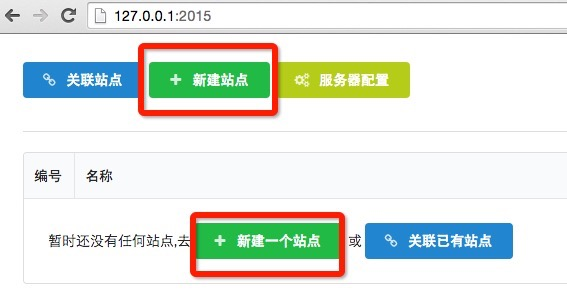
* 在弹窗中填写站点名称`blog`;填写站点的开发路径(可用 `{{homedir}}`占位符指向用户目录),eg: `{{homedir}}/blog`.
* 点击`创建`,提示成功, 点击弹窗外区域,关闭弹窗，发现 `blog` 站点已经创建
* 点击站点名称,进入站点的模块管理页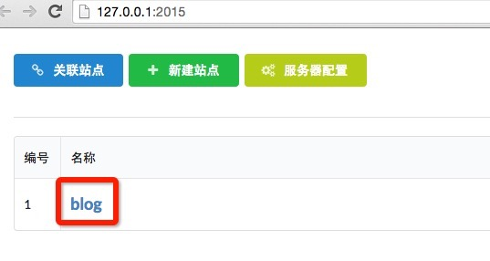
* 进入blog站点的项目管理界面,发现lib目录下自动生成了`jquery/1.9.3`和`parser/0.0.1`两个模块

>前端开发一般通过svn,git等版本控制工具进行源码管理，当开发者A创建完站点之后,开发者B就可以通过版本控制工具拉取代码到本地，然后就可以通过 `关联站点` 操作把该站点加入管理列表

### 2.初始化模块
#### <1.初始化www/common/1.0.0模块
* 点击新建模块按钮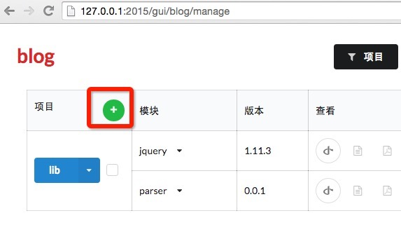
* 填写相关的信息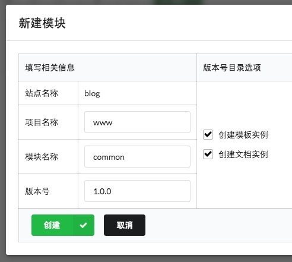 点击创建
* 在GUI中可以发现,该模块已经初始化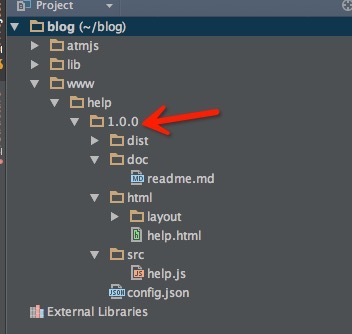
* 进入开发目录,发现 `~/blog/www/common/1.0.0`目录下是刚初始化产生的文件
* 至此 `www/common/1.0.0` 模块已经成功初始化
#### <2.初始化www/help/1.0.0模块
* 因为www项目已经存在,所以先点击`www`项目名称,再点击`新建模块`按钮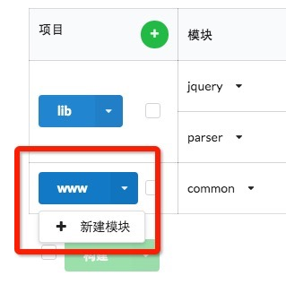
* 填写相关的信息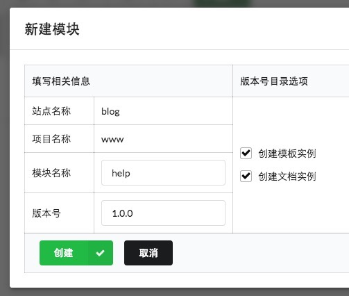 点击创建
* 在GUI中可以发现,该模块已经初始化 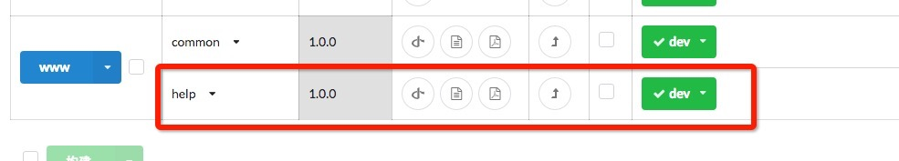
* 进入开发目录,发现`~/blogwww/help/1.0.0`目录下是刚初始化产生的文件 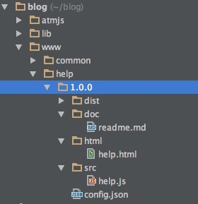

### 3.模块相关信息的查看
#### <1.查看`src`目录下静态文件的id
* 在初始化模块后,可以通过在GUI中点击`文件列表`按钮 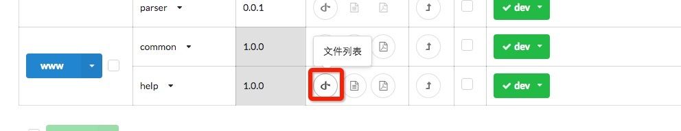
* 接着会弹出src目录下文件的相关信息,包括文件的id 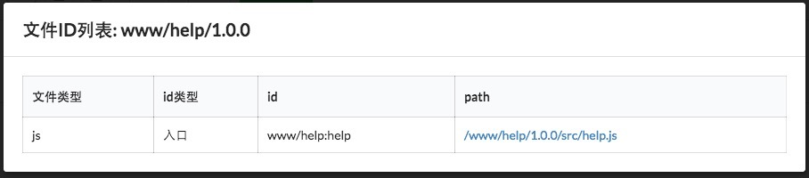
* 文件的id在跨模块静态文件依赖和跨模块模板中会用到

#### <2.模板预览
* 在初始化模块后,可以通过在GUI中点击`查看模板及数据`按钮,进入模板列表页 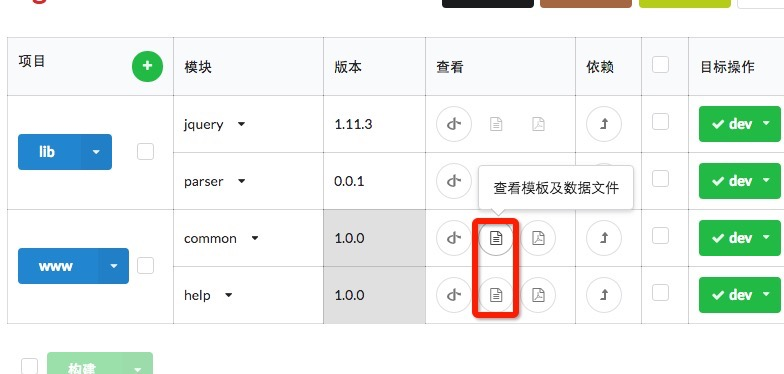
* 列表页列出了`html/`目录下的所有的文件,点击对应的文件即可进行预览
* 当然也可以直接通过地址`http://127.0.0.1:2015/files/site/project/module/version/html/**`打开对应的模板


### 4.开发模块

#### <1.开发www/common/1.0.0模块
* 在src目录下新建common.css
* `src/common.js`依赖`src/common.css`,`src/common.js`代码如下：
```js
// @require ./common.css
```
* 至此,我们的`www/common/1.0.0`模块已经搭建完毕

#### <2.开发www/help/1.0.0模块
* 在src目录下新建help.css
* `src/help.js`依赖`www/common/1.0.0/src/common.js`和'src/help.css`
* 从GUI中查看到`www/common/1.0.0/src/common.js`文件的id为 `www/common:common`
* `src/help.js`文件代码如下:
```
require('www/common:common');
// @require ./help.css
```
* 再次查看`http://127.0.0.1:2015/files/blog/www/help/1.0.0/html/help.html`模板
* 发现 `www/common/1.0.0/src/common.css`,`www/help/1.0.0/src/help.css`,`www/common/1.0.0/src/common.js`,`www/common/1.0.0/src/help.js`都已被引入到模板

