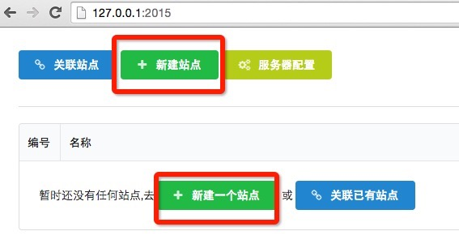
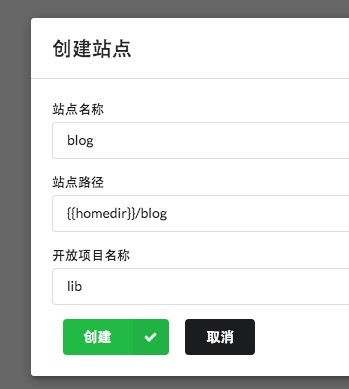

## 安装与启动
1. 安装node.js(>=0.12.x)
2. 安装atjs(mac osx系统可能需要使用sudo执行下面的命令)

```
npm install atmjs -g
```

3. 命令行进入任意目录,执行 `atmjs start` 命令启动atmjs服务器
4. 当看到命令行输出 `http server:2015` 时说明atmjs服务器启动成功
5. 浏览器(chrome/firefox)打开`http://127.0.0.1:2015` 可进入GUI界面

## Demo
#### 站点需求
开发一个博客网站，具有以下功能：
* 网站前台：文章展示,帮助中心
* 用户后台：文章管理功能,分类管理,登陆注册,账号管理等功能
* 管理员后台：用户管理等一系列功能

#### 功能梳理
```
|--Blog
    |--www
        |--art
            |--1.0.0
                |--html(模板目录)
                    |--index.html(首页模板)
                    |--list.html(列表页模板)
                    |--info.html(内容页模板)
                |--src
                    |--index.js(首页脚本)
                    |--art.js(列表页和内容页脚本)
                    |--art.css(首页,列表页和内容页样式)
        |--help
            |--1.0.0
                |--html
                    |--help.html(帮助页模板)
                |--src
                    |--help.js(帮助页脚本)
                    |--help.css(帮助页样式)
    |--user
        |--art
            |--1.0.0
                |--html
                    |--create.html(创建博客模板)
                    |--edit.html(编辑博客模板)
                    |--list.html(博客管理模板)
                |--src
                    |--art.js(创建,编辑和列表页面的脚本)
                    |--art.css(创建,编辑和列表页面的样式)
        |--cate
            |--1.0.0
                |--html
                    |--create.html(创建分类模板)
                    |--edit.html(编辑分类模板)
                    |--list.html(分类管理模板)
                |--src
                    |--cate.js(创建,编辑和列表页面的脚本)
                    |--cate.css(创建,编辑和列表页面的样式)
        |--account
            |--1.0.0
                |--html
                |--src
                    |--login.js
                    |--reg.js
                    |--account.js
    |--admin
        |--user
            |--1.0.0
                |--html
                    |--create.html(创建用户模板)
                    |--edit.html(编辑用户信息模板)
                    |--list.html(用户列表页模板)
                |--src
                    |--user.js(创建,编辑和列表页面的脚本)
                    |--user.css(创建,编辑和列表页面的样式)

```
#### 新建站点
* 打开GUI，点击 `新建站点` 按钮
* 在弹窗中填写站点名称`blog`;填写站点的开发路径(可用 `{{homedir}}`占位符指向用户目录),eg: `{{homedir}}/blog`.
* 点击`创建`,提示成功, 点击弹窗外区域,关闭弹窗，发现 `blog` 站点已经创建
* 点击站点名称,进入blog站点的项目管理界面,发现lib目录下自动生成了`jquery/1.9.3`和`parser/0.0.1`

首先演示 `www/art/1.0.0` 的开发
